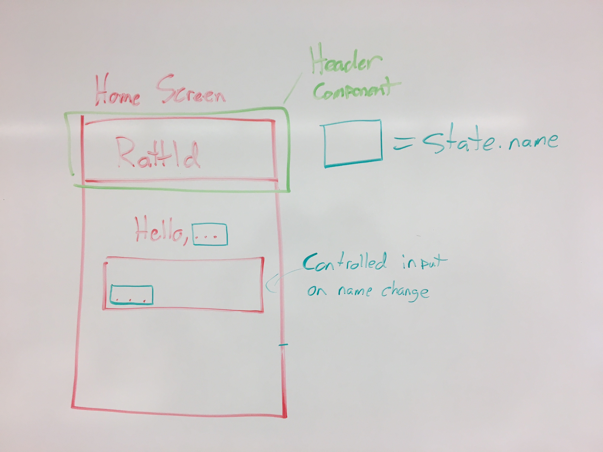
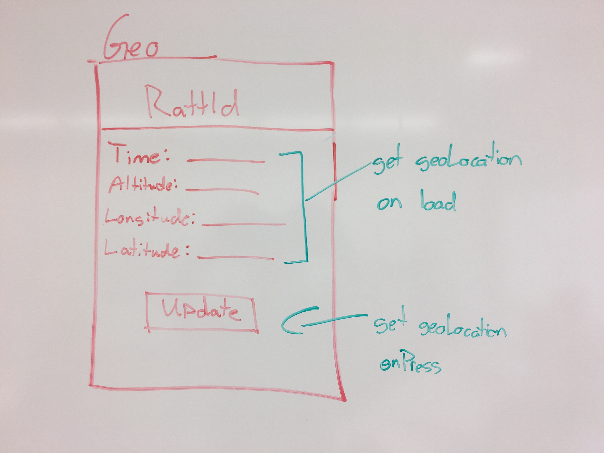
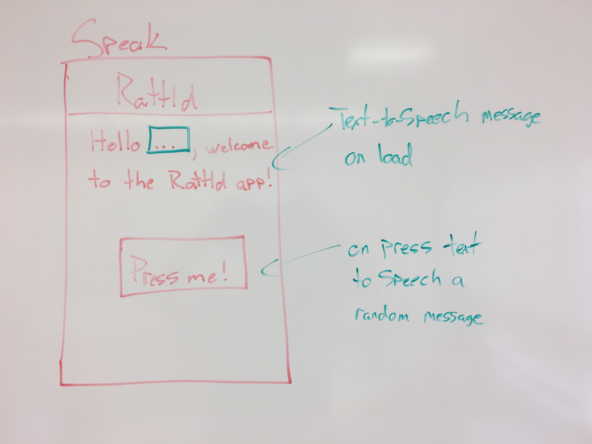

# Rattld

## Table of Contents
* [Description](#description)
* [Setup](#setup)
* [Learnin'](#learnin)
* [Wireframes](#wireframes)
* [Links and Resources](#links-and-resources)
* [Authors](#authors)

### Description
A React Native app built with the help of Expo. This app takes your name as input and greets you with your geo-location. When you're ready, it will randomly generate a phrase and sweetly play it back to you, along with your name. 

**NOTE**: Turn up the volume of your device!

The Settings Screen is provided by the `expo init` project generator when you choose a `tabs` managed workflow. We kept this screen with zero modification.

[--top--](#table-of-contents)

### Setup
Make sure you have installed the Expo command line tool:

`npm install -g expo-cli`

And the Expo client for your device OS:

[Google Play Store](https://play.google.com/store/apps/details?id=host.exp.exponent&hl=en_US)

[Apple App Store](https://apps.apple.com/us/app/expo-client/id982107779)

Clone the project and install packages:

`git clone https://github.com/rattld/rattle.git && cd rattle && npm install`

Now run:

`npm start`  

[--top--](#table-of-contents)

### Learnin'

Below are wiki articles on various topics related to this project. You will find them useful if you are new to React Native/Expo and want to learn more about how this project works.

[Running the app on your phone](https://github.com/rattld/rattle/wiki/Running-the-app-on-your-phone)

[React Native Navigation](https://github.com/rattld/rattle/wiki/What-the-heck-does-it-do%3F#navigation)

[NOT HTML FOR YOU](https://github.com/rattld/rattle/wiki/Coming-soon...)

[expo-cli](https://github.com/rattld/rattle/wiki/Coming-soon...)

[Expo Location](https://github.com/rattld/rattle/wiki/Coming-soon...)

[--top--](#table-of-contents)

### Wireframes
These initial wireframes drove our design decisions, with few changes made along the way

[--top--](#table-of-contents)

### Links and Resources

[React Native](https://facebook.github.io/react-native/)
  * [Getting started](https://facebook.github.io/react-native/docs/getting-started)
  * [Basics](https://facebook.github.io/react-native/docs/tutorial)
  * [Style](https://facebook.github.io/react-native/docs/style)

[Expo](https://expo.io/)
  * [Snack](https://snack.expo.io/)
  * [Speech](https://docs.expo.io/versions/v33.0.0/sdk/speech/)
  * [Location](https://docs.expo.io/versions/v33.0.0/sdk/location/)

[--top--](#table-of-contents)

### Authors
[Adam DuQuette](https://github.com/DukeOfEtiquette)

[Calvin Cheng](https://github.com/calvincheng919)

[Nathaniel Pierce](https://github.com/natkiypie)
